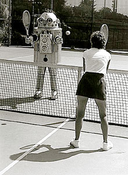
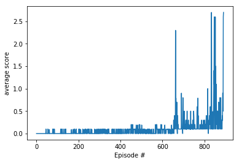

# Collaboration and Competition

    

## Table of Contents

1. [Introduction](#introduction)
2. [Directory Structure](#directoryStructure)
3. [Installation](#installation)
4. [Instructions](#instructions)
5. [Results](#results)

## Introduction 

    

## Directory Structure 

- Root /
    - README.md (This readme file)
    - Report.md (A report describing results)
    - Tennis.ipynb (The Jupyter notebook)
    - model.py (The neural network)
    - agent.py (The agent used for learning)
    - checkpoint.pth (The neural network weights for the actors and critics)
    - .gitignore (Git uses it to determine which files and directories to ignore)
    - images /  
        - robot-tennis.jpg  (Image of a robot playing tennis)
        - scores_plot.png (Plot of the scores during the learning process)
        - MADDPG.png (Image of MADDPG pseudocode)
        
## Installation 

This project was written in Python 3.6, using a Jupyter Notebook on Anaconda. Currently (September 2019) you cannot use Python 3.7, since tensorflow 1.7.1 doesn't have a version corresponding to python 3.7 yet.

## Instructions 

Follow the instructions in Collaboration_and_Competition.ipynb to get started.

## Results 

The environment was solved in 890 episodes. An averaged score of 0.504 was reached. 
Below is a plot with the scores:

A more detailed description of the results can be found in the Report.md file.