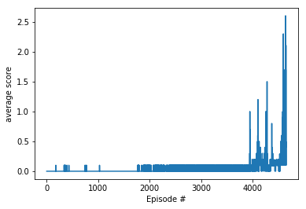

# Project 3: Collaboration and Cooperation

Author: [Harald Wilbertz](http://github.com/wilbertz) 

The report contains three parts:

- **Design and Implementation**
- **Results**
- **Future Improvements** 

## Design and Implementation

An Ornstein-Uhlenbeck process (Uhlenbeck & Ornstein, 1930) with &mu; = 0.15 and &theta; = 0.2 was used in order to add noise.
This process is a stationary Gauss–Markov process, which means that it is a Gaussian process, a Markov process, and is temporally homogeneous.

The algorithm uses two deep neural networks (actor-critic).
The Actor model is a neural network with 2 hidden layers with size of 400 and 300. The
neural networks used the rectified non-linearity (Relu) for all hidden layers.
Tanh is used in the final layer that maps states to actions. Batch normalization is used for mini batch training.
The Critic model is similar to Actor model except the final layer is a fully connected layer that maps states and 
actions to Q-values.

The final layer weights and biases of both the actor and critic
were initialized from a uniform distribution [−3 × 10−3, 3 × 10−3] and [3 × 10−3, 3 × 10−3]. 
This was to ensure the initial outputs for the policy and value estimates were near zero. The hidden layer were 
initialized using Xavier initialization.

An ADAM optimizer was used to learn the network parameters.

### Hyperparameters

  The code uses a lot of hyperparameters. The values a are given below

  | Hyperparameter                      | Value   |
  | ----------------------------------- | ------- |
  | Gamma (discount factor)             | 0.99    |
  | Tau                                 | 1e-3    |
  | Learning rate actor                 | 1e-3    |
  | Learning rate critic                | 1e-3    |
  | Batch size                          | 1024    |
  | Replay buffer size                  | 1000000 |

## Results

The environment was solved in 890 episodes. An averaged score of 0.504 was reached. 
Below is a plot with the scores:

## Ideas for improvement